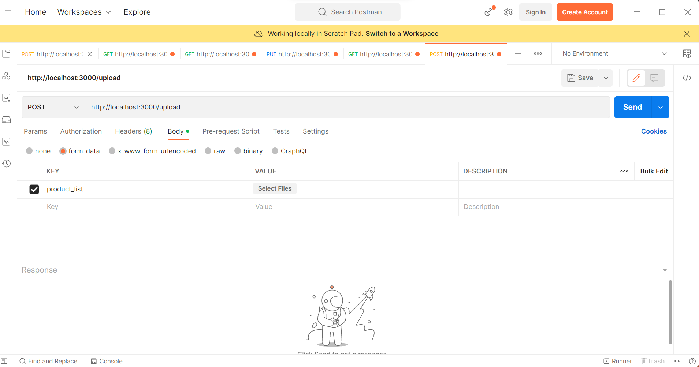
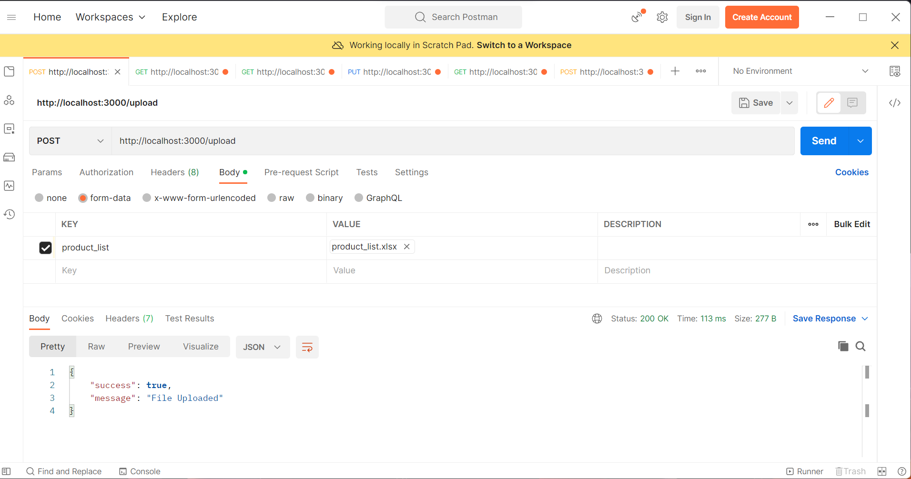
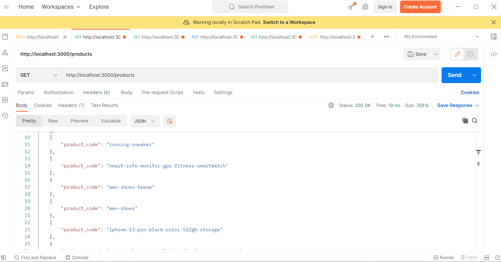
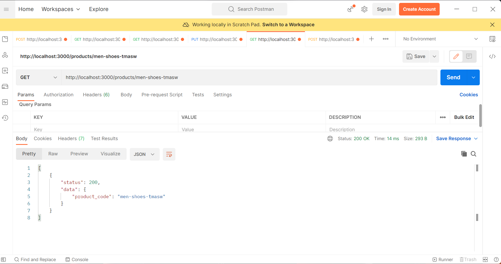
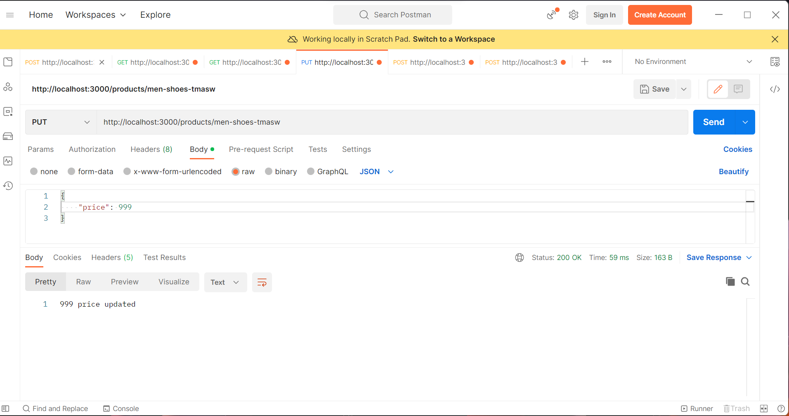
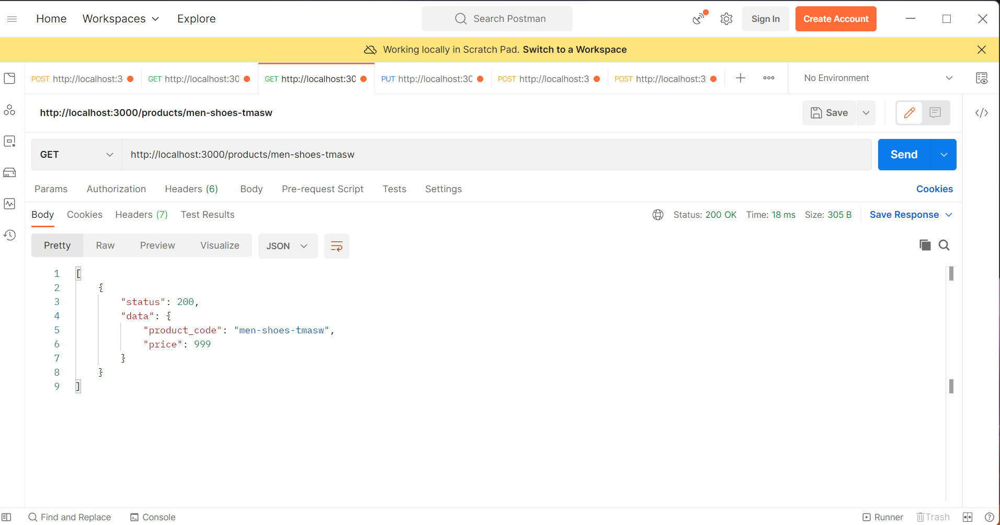
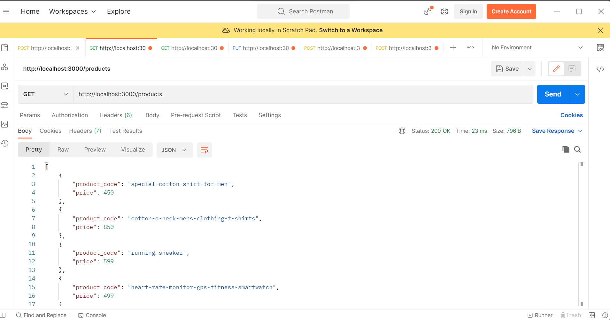

# H3mart

### Initialize
> run "npm init" in the terminal


### Install
```
npm install body-parser, express, express-fileupload, xlsx
```

### Run the server
>npm start

### Step 1
```
"To upload the file in the Rest Api"
Go to "http://localhost:3000/upload" and set the method to post
```



### Step 2
```
To get the data of products , go to "http://localhost:3000/products" and set the method to get
```


### Step 3
```
To get the data of product , go to "http://localhost:3000/products<product_code>" and set the method to get
```


### Step 4
```
To update the price of product , go to "http://localhost:3000/products<product_code>" and set the method to put
and add json object in body
```



### Step 5
```
To get the data of product from the updated file,go to "http://localhost:3000/products<product_code>" and set the method to get
```


### Step 6
```
To get all data of product from the updated file, go to "http://localhost:3000/products" and set the method to get
```


